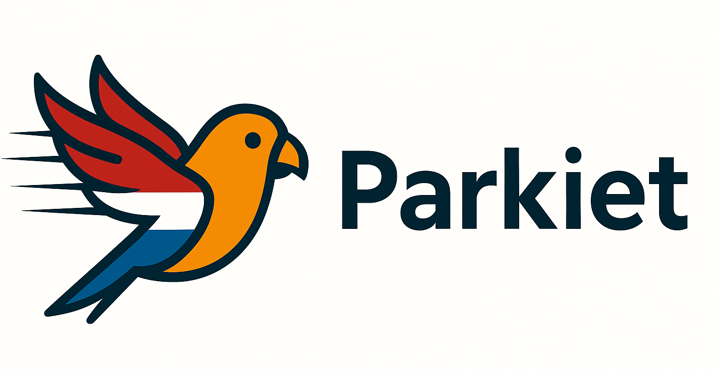

# Parkiet: Dutch Text-to-Speech (TTS)



Open-weights Dutch TTS based on the [Parakeet](https://jordandarefsky.com/blog/2024/parakeet/) architecture, ported from [Dia](https://github.com/nari-labs/dia) to JAX for scalable training. A full walkthrough to train the model for your language on Google Cloud TPUs, can be found in the [TRAINING.md](TRAINING.md) doc. A comparison to ElevenLabs can be found on my [blog](https://peterevers.nl/posts/2025/09/parkiet/).

**Parkiet creates highly realistic voices from text**. You can guide the audio output to control emotion and tone. The model also supports nonverbal sounds (currently only laughter), and up to four different speakers per prompt. Voice cloning is also supported. Here are some samples.

| Text | File |
|---|---|
| [S1] denk je dat je een open source model kan trainen met weinig geld en middelen? [S2] ja ik denk het wel. [S1] oh ja, hoe dan? [S2] nou kijk maar in de repo op Git Hub of Hugging Face. |  <video src="https://github.com/user-attachments/assets/1b0ac1be-717e-4bdf-83a5-b5a501f67057">
| [S1] hoeveel stemmen worden er ondersteund? [S2] nou, uhm, ik denk toch wel meer dan twee. [S3] ja, ja, d dat is het mooie aan dit model. [S4] ja klopt, het ondersteund tot vier verschillende stemmen per prompt. | <video src="https://github.com/user-attachments/assets/6e428840-ca65-4b24-a63d-b6358d08b2f8"> 
| [S1] h h et is dus ook mogelijk, om eh ... uhm, heel veel t te st stotteren in een prompt. | <video src="https://github.com/user-attachments/assets/0217d156-3729-4f2d-b6ec-5f7e8ce3f050"> |
| [S1] (laughs) luister, ik heb een mop, wat uhm, drinkt een webdesigner het liefst? [S2] nou ... ? [S1] Earl Grey (laughs) . [S2] (laughs) heel goed. | <video src="https://github.com/user-attachments/assets/a77e654a-4b2d-4e6e-959b-397d8dadf87a">
| [S1] je hebt maar weinig audio nodig om een stem te clonen de rest van deze tekst is uitgesproken door een computer. [S2] wauw, dat klinkt wel erg goed. [S1] ja, ik hoop dat je er wat aan hebt. | <video src="https://github.com/user-attachments/assets/f80d6b27-0719-4044-89cc-ae19230505ee">

## Generation Guidelines

* Use `[S1]`, `[S2]`, `[S3]`, `[S4]` to indicate the different speakers. Always start with `[S1]` and always alternate between [S1] and [S2] (i.e. [S1]... [S1]... is not good).
* Prefer lower capital text prompts with punctuation. Write out digits as words. Even though the model should be able to handle some variety, it is better to stick close to the output of [WhisperD-NL](https://huggingface.co/pevers/whisperd-nl).
* Slowing down can be encouraged by using `...` in the prompt.
* Stuttering and disfluencies can be encouraged by using `uh`, `uhm`, `mmm`.
* Laughter can be added with the `(laughs)` tag. However, use it sparingly because the model quickly derails for too many events.
* Reduce hallucination by tuning the text prompts. The model can be brittle for unexpected events or tokens. Take a look at the example sentences and mimick the style.

## News

**September 28, 2025**: Added tensorsafe format support allowing the model to run directly in the Dia pipeline without conversion.

## Quickstart

There are three flavours of the model. The HF transformers version (recommended), the original JAX model, and the backported PyTorch model. The HF transformers version is the easiest to use and integrates seamlessly with the Hugging Face ecosystem.

### HF Transformers (Recommended)

```bash
uv sync # For CPU
uv sync --extra cuda # For CUDA

# Run the inference demo with HF transformers
uv run python src/parkiet/dia/inference_hf.py
```

<details>

<summary>PyTorch</summary>

```bash
# Make sure you have the runtime dependencies installed for JAX
sudo apt-get install build-essential cmake protobuf-compiler libprotobuf-dev

uv sync # For CPU
uv sync --extra cuda # For CUDA

wget https://huggingface.co/pevers/parkiet/resolve/main/dia-nl-v1.pth?download=true -O weights/dia-nl-v1.pth
uv run python src/parkiet/dia/inference.py
```

</details>

<details>

<summary>JAX</summary>

```bash
# Make sure you have the runtime dependencies installed for JAX
sudo apt-get install build-essential cmake protobuf-compiler libprotobuf-dev

uv sync --extra tpu # For TPU
uv sync --extra cuda # For CUDA

# Download the checkpoint
wget https://huggingface.co/pevers/parkiet/resolve/main/dia-nl-v1.zip?download=true -O weights/dia-nl-v1.zip

# Create the checkpoint folder and unzip
mkdir -p weights
unzip weights/dia-nl-v1.zip -d weights

# Run the inference demo
# NOTE: Inference can take a while because of JAX compilation. Subsequent calls will be cached and much faster. I'm working on some performance improvements.
uv run python src/parkiet/jax/inference.py
```

</details>

## Hardware Requirements

| Framework | float32 VRAM | bfloat16 VRAM |
|---|---:|---:|
| JAX | ≥19 GB | ≥10GB |
| PyTorch | ≥15 GB | ≥10GB |

Note: `bfloat16` typically reduces VRAM usage versus `float32` on supported hardware to about 10GB. However, converting the full model to `bfloat16` causes more instability and hallucinations. Setting just the `compute_dtype` to `bfloat16` is a good compromise and is also done during training. We would like to reduce the VRAM requirements in a next training run.

## ⚠️ Disclaimer
This project offers a high-fidelity speech generation model intended for research and educational use. The following uses are strictly forbidden:

* Identity Misuse: Do not produce audio resembling real individuals without permission.
* Deceptive Content: Do not use this model to generate misleading content (e.g. fake news).
* Illegal or Malicious Use: Do not use this model for activities that are illegal or intended to cause harm.
By using this model, you agree to uphold relevant legal standards and ethical responsibilities. We are not responsible for any misuse and firmly oppose any unethical usage of this technology.

## Training

For a full guide on data preparation, model conversion and the TPU setup to train this model for any language, see [TRAINING.md](TRAINING.md).

## Acknowledgements

* Darefsky for the excellent blog post on [Parakeet](https://jordandarefsky.com/blog/2024/parakeet/).
* [Dia](https://github.com/nari-labs/) for open-sourcing the PyTorch model.
* [Bas Büller](http://github.com/basbuller) for the endless discussions until it finally worked 🙌.
* [Google Cloud TPU Research Cloud Program](https://sites.research.google/trc/about/) for providing the computation resources.

## License

Repository code is licensed under the [MIT License](LICENSE). The TTS model itself is licensed as [RAIL-M](MODEL_LICENSE).
