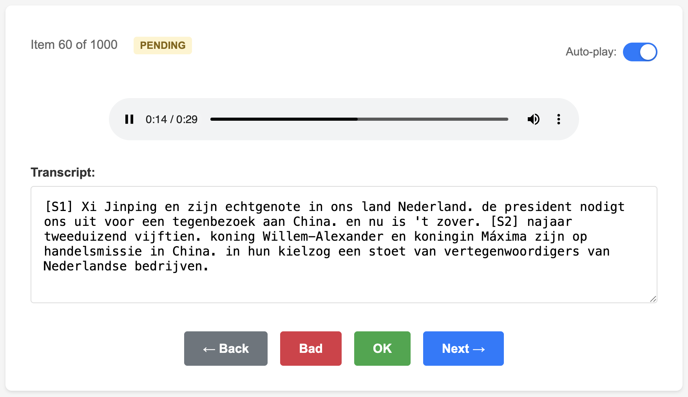
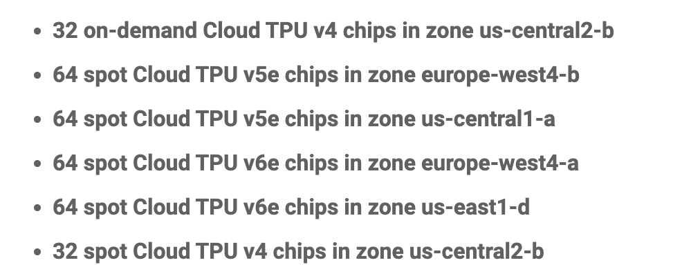
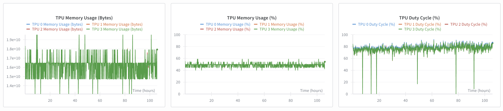
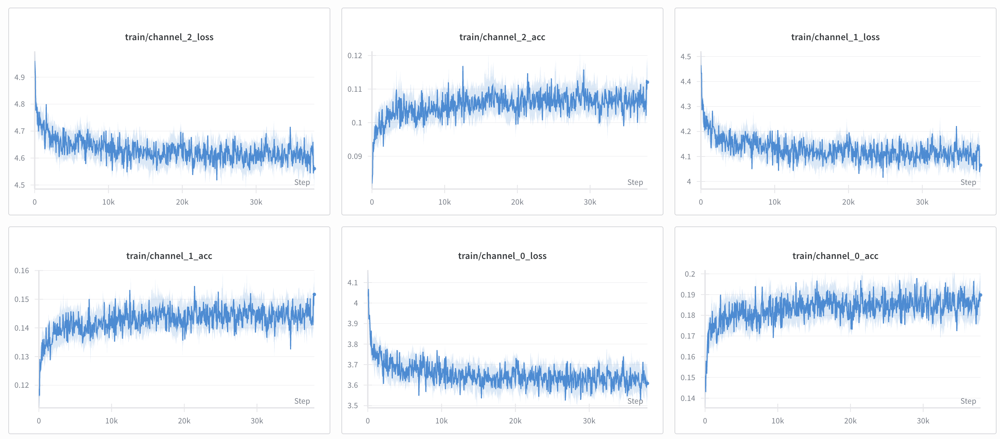

# Training Guide

This guide explains how to train your own TTS model similar to **Parkiet**, a Dutch text-to-speech system. It covers synthetic data generation, Whisper fine-tuning, and training a 1.6B parameter model on Google Cloud TPUs with JAX. All source code is included in this repository.  

There may still be some rough edges, as I no longer have access to Google Cloud TPUs—so contributions are very welcome. It took me months to move from a Torch model to a fully working JAX training pipeline, and I hope this guide helps you avoid the same pitfalls.

Training took around 2-3 days, and the total cost *can* be under $100.  
*I say "can" because I wasn’t careful with Google Cloud egress fees, which ended up costing me about $400.*

# Contents

- [Introduction](#introduction)  
- [Pre-processing and Data](#pre-processing-and-data)  
  - [Synthetic Data Collection Strategy](#synthetic-data-collection-strategy)  
  - [WhisperD-NL: Fine-tuned for Dutch Authenticity](#whisperd-nl-fine-tuned-for-dutch-authenticity)  
  - [Data Collection Pipeline](#data-collection-pipeline)  
  - [Data Annotation & Quality Control](#data-annotation--quality-control)  
- [Model Conversion](#model-conversion)  
  - [PyTorch to JAX Conversion](#pytorch-to-jax-conversion)  
- [Training](#training)  
  - [Training Configuration](#training-configuration)  
  - [Monitoring](#monitoring)  
- [Next Steps](#next-steps)  

## Introduction

Parkiet is based on the [Parakeet](https://jordandarefsky.com/blog/2024/parakeet/) architecture by Darefsky et al., an autoregressive text-to-speech model known for producing high-quality speech. The architecture was ported directly from the PyTorch implementation—[Dia](https://github.com/nari-labs/dia)—to JAX, without changes, allowing us to reuse the English base model.

Most preprocessing was performed on an NVIDIA RTX 5090 GPU. Whisper was fine-tuned on this machine to better handle Dutch disfluencies and speaker identification. Fine-tuning used about 10,000 hours of publicly available podcast data. The TTS training itself ran on Google Cloud TPUs through the [Research Grant](https://sites.research.google/trc/about/).

## Pre-processing and Data

### Synthetic Data Collection Strategy

For realistic Dutch TTS, audio and text must be aligned while preserving natural speech patterns. Standard ASR models often “clean up” transcripts, removing fillers and disfluencies that are essential for natural-sounding TTS.

**Example – Natural Speech Patterns**

```
Standard ASR: "Ja dat is een goede vraag"
WhisperD-NL: "Ja eh d dat is een eh goede vraag"
```

**Example – Filler Sounds**
```
Standard ASR: "Het probleem is complex"
WhisperD-NL: "Het probleem is uhm complex eh"
```

#### WhisperD-NL: Fine-tuned for Dutch Authenticity

[WhisperD-NL](https://github.com/pevers/whisperd-nl) is a fine-tuned version of OpenAI’s whisper-large-v3, trained specifically to preserve Dutch disfluencies and natural speech patterns critical for TTS training. It was fine-tuned on the [Corpus Gesproken Nederlands](https://taalmaterialen.ivdnt.org/) (CGN), which contains 900 hours of high-quality Dutch speech. The dataset is available for non-commercial use from the Instituut voor Nederlandse Taal (IVDNT).  

Dutch tends to perform well on WER benchmarks, likely because of its similarity to English and the availability of datasets like CGN. For smaller languages, building a good disfluency model is more challenging—but even 10 hours of well-annotated data can yield strong results. WhisperD-NL was also trained to output speaker tags (`[S1]`, `[S2]`, etc.) and events like `(laugh)`.


On an RTX 5090 GPU, whisper-large-v3 runs efficiently with `bfloat16`, `torch.compile`, and flash attention, allowing processing of ~100 hours of data per hour.

### Data Collection Pipeline

Our pipeline processed roughly **10,000 hours of Dutch podcasts** for fine-tuning. Redis and PostgreSQL can be used to scale across multiple GPUs, though most processing happened on a single RTX 5090.

**Pipeline Steps:**

1. **Start Processing Infrastructure**
   ```bash
   docker-compose up -d
   ```
   Starts the Redis and PostgreSQL services required for the processing pipeline.

2. **Queue Audio Files for Processing**
   ```bash
   uv run python src/parkiet/audioprep/queue_files.py bucket_mp3_files.txt
   ```
   Queues all files to be processed by the pipeline. The [scan_bucket_files.py](src/parkiet/audioprep/scan_bucket_files.py) script can be used to scan the bucket and create a list of files to be processed if necessary.
  
3. **Process Audio Files**
   ```bash
   uv run python src/parkiet/audioprep/chunk_extractor.py
   ```
   Splits files into chunks and transcribes them using both whisper-large-v3 (clean transcripts) and WhisperD-NL (disfluent transcripts). Speaker embeddings are also stored for balancing.
4. **Write Arrow Files**
   ```bash
   uv run python src/parkiet/audioprep/arrow_writer.py
   ```
   Saves audio in Parquet format using a low-bitrate Descriptive Audio Codec (DAC). The 10,000 hours compress to ~42 GB.
   **Important:** Store Parquet files in a Google Cloud Storage bucket in the same region as your TPUs to avoid costly egress.

### Data Annotation & Quality Control

I built a small web app to annotate audio data. While training, I used downtime to fix speaker tags and events.



A 2-hour annotated dataset can already improve the model performance in a last training run. However, I've never used it as the model was already performing very well and my cloud credits also expired by the time training was finished.

## Model Conversion

### PyTorch to JAX Conversion

Before training, the PyTorch Parakeet model must be converted to JAX using Flax NNX for TPU compatibility. We converted each layer manually and documented the process in [tests/test_jax_conversion.py](tests/test_jax_conversion.py).
.

Flax NNX’s object-oriented design makes this easier, though there are automatic converters available. I chose manual conversion to avoid debugging subtle issues from automated tools.

Convert a model with:

```bash
uv run python src/parkiet/convert_to_jax.py --checkpoint weights/dia-v1.pth --output weights/dia-jax-v1
```

## Training

For development, a simple single-device script is provided:

**Single-device training (development):**
```bash
uv run python src/parkiet/jax/train.py
```

To address the problem of class imabalance we store weights for the samples when we generate the Parquet files. However, our class balanced model performed worse than the original naive model, hence we don't use it. The weights are computed using the [Class-Balanced Loss](https://arxiv.org/abs/1901.05555) approach.

**Multi-device/distributed training (production):**

For production training on multiple devices we need to start the [train_distributed.py](src/parkiet/jax/train_distributed.py) script. A helper script is created to update the repository, sync the dependencies and start the training in the background while logging to Weights & Biases via [start_training.sh](start_training.sh).

### Training Configuration

Google Cloud Research Grant provides access to TPUs for a full month for free. I was able to use the following devices.



I tried using the spot instances but I was not able to maintain them for more than 10 minutes so I settled with the **t4-32**. There is a script that aggressively polls until it manages to snatch one [here](tpu_manager.py).

A t4-32 chip has a total of 16 chips. Each TPU v4 chip has two TensorCores. by default v4 pairs those two cores to act as one JAX device (“megacore”), so JAX exposes 1 device per chip.

If you use a different TPU, you’ll need to adjust the mesh and batch size.

#### Fully Shared Data Parallel (FSDP) Training and Meshing

There are multiple options to train a *small* large TTS model on a TPU cluster. Ideally we use simple "Data Parallism" to train the model. This means that we split the data into shards and every device gets one piece of the batch. Every device has the same model parameters and gradients are averaged across all devices. This is the simplest way to train the model. Unfortunately, the Parakeet model was too big to fit in the 32 GiB HBM memory of the t4, so we had to shard the model parameters over the devices.

Since we use Flax NNX, we can make use of the "automatic" scenario of sharding described in the JAX [docs](https://flax.readthedocs.io/en/latest/guides/flax_gspmd.html).

Our mesh is defined like this:

```python
def make_mesh_dp_mp():
    """Create mesh for data and model parallel sharding."""
    procs = jax.process_count()  # 4 for t4-32
    local = jax.local_device_count()  # 4 for t4-32
    total_devices = jax.device_count()

    logger.info(
        f"Creating mesh: processes={procs}, local_devices={local}, total={total_devices}"
    )
    assert procs * local == total_devices, (
        f"Device count mismatch: {procs} * {local} != {total_devices}"
    )

    # For data and model parallel
    devs = np.array(jax.devices()).reshape(procs, local)
    mesh = Mesh(devs, axis_names=("data", "model"))
    logger.info(f"Created mesh with shape {mesh.shape} and axes {mesh.axis_names}")
    return mesh


mesh = make_mesh_dp_mp()
```

This creates a mesh so that each device is processing 1/4 of the data AND 1/4 of the model parameters. Data parallelism refers to both **input data** and the **activations** (intermediate arrays computed during the forward pass). Before executing a layer or module, JAX will communicate the respective parameters across devices such that we can process the data in parallel. In the backward pass, our JAX optimizer will communicate the gradients back to the respective devices and update the model.

All of this is done automatically, we just have to annotate our layers with the `nnx.with_partitioning` decorator so that the model is automatically sharded.

```python
self.wo = nnx.LinearGeneral(
    axis=(-1,),
    in_features=(intermediate_dim,),
    out_features=(embed_dim,),
    use_bias=False,
    param_dtype=param_dtype,
    dtype=compute_dtype,
    kernel_init=nnx.with_partitioning(ki, ("model", None)),
    rngs=rngs,
)
```

And by `@jit` compiling our model, we let JAX handle the rest.

```python
@nnx.jit()
def create_model(...):
  ...
```

### Monitoring

I've used Weights & Biases to monitor the training process. You can get a free account [here](https://wandb.ai/) and get a free "Pro" trial for a month. It works well to monitor training progress and it has automatic support for monitoring TPU device metrics.



Weights & Biases can be enabled by providing a `.env` file on your JAX hosts, or by directly setting the key in the training script. I recommend transferring a dedicated `.env` file to all host machines so that you don't accidentally commit your API key to the repository.

Loss for the 8 audio channels are tracked and are a good indicator of the model performance.



As you can see the model doesn't change drastically. After a couple thousand steps the model is already able to generate Dutch speech. I let it run for 3 epochs but it hardly improves anymore after 1 epoch.

The different loss channels show the hierarchical pattern explained by [Darefsky](https://jordandarefsky.com/blog/2024/parakeet/). The loss on channel 1 follows the loss on channel 2, which follows the loss on channel 3, and so on. Disabling the "delay pattern" will result in significant degradation of the model performance.

The training process typically takes 2-3 days on TPU v4 pods for the complete Dutch dataset.

## Deployment and Inference

Ideally we convert the model back to PyTorch and plug-and-play it into the Dia pipeline. There is already support for HuggingFace's Transformers, so we can directly use this and have an accessible interface. However, after converting the model to PyTorch, I noticed a significant performance degradation. The model was still able to generate speech, but the model is more fragile and quickly derails in more complex sentences. I suspect that there is a difference in the attention kernel between PyTorch and JAX. 

How can we fix this?

Well, I didn't want to get into writing custom kernels, so I spun up a 8xA100 machine on [Lambda](http://lambda.ai/) and fine-tuned the model for a couple thousand more steps on CUDA hardware. Luckily JAX supports CUDA, so with little tweaks to the mesh we can run the model. However, **it didn't solve the problem**. So any more ideas (except fully retraining on CUDA hardware w/o JAX) are welcome.

## Next Steps

As described in the original paper there are some interesting next steps to explore. One of them is replacing the auto-regressive decoder with [Block Diffusion (BD3‑LMs)](https://m-arriola.com/bd3lms/): an approach that autoregressively models blocks while doing discrete diffusion within each block. It preserves AR-level quality and KV caching while enabling parallel token sampling for low latency streaming.

If you have compute and don't know what to do with it, please contact me! I'm GPU poor with many ideas.